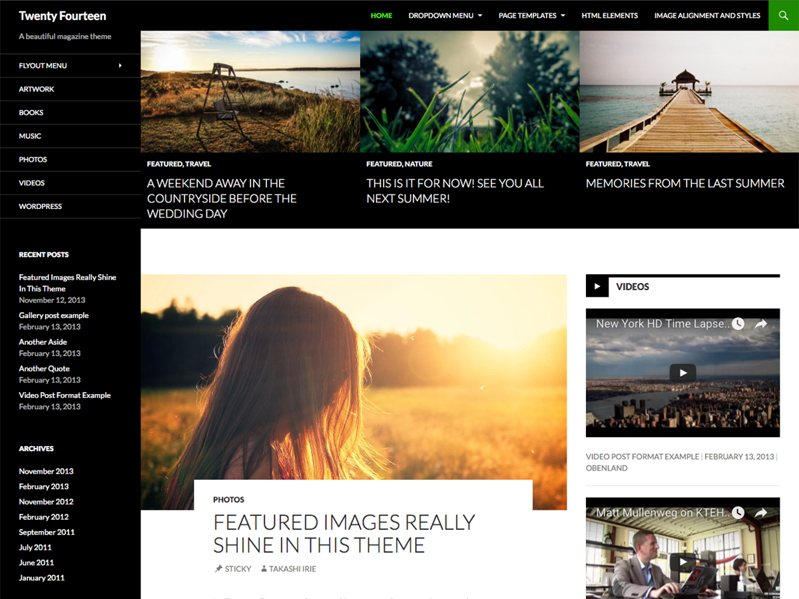

# Twenty Fourteen Child Theme

Twenty Fourteen Child Theme is a responsive, two-column, full width theme based on the [WordPress theme](https://wordpress.org/themes/twentyfourteen).

Screenshot:

# Installation

## Access install theme functionality in your WP admin

The first thing you need to do when you want to install a new WordPress theme is to login to your site admin page. Once there, go to Appearance -> Themes.

Here, you will see all the themes you have currently installed in your application. To add another one, simply click on the Install Themes tab.

On this page there are two ways to add a new theme. You can either use the search field which will return results from the WordPress.org theme directory or you can upload a theme from your local hard drive. In this tutorial we will show you how to add themes in upload way only.

## Upload a theme you have already downloaded from [here](##)

You can simply upload it from the Themes -> Install Themes section in WordPress. To do this click on the Upload link at the top of the page.

Now, click the Choose File button, select the archive of your theme from your local computer and press the Install Now button.

In few seconds, WordPress will upload and extract the theme archive for you. All you need to do next is to press the Activate link under the message for successful theme installation.

That's it! You can now go to the front end of your site and see the newly activated theme.

## License

Open Source under the [GPL license](LICENSE.md) (inherited from the original theme)